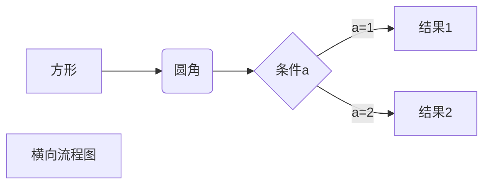
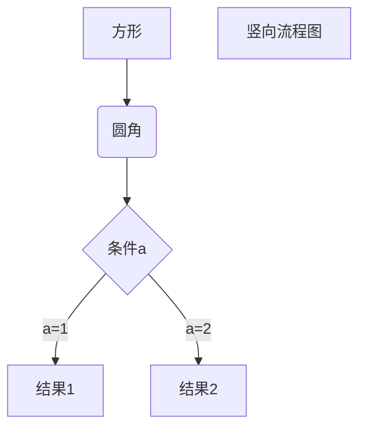
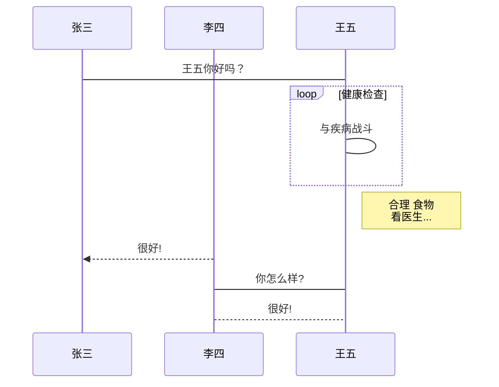
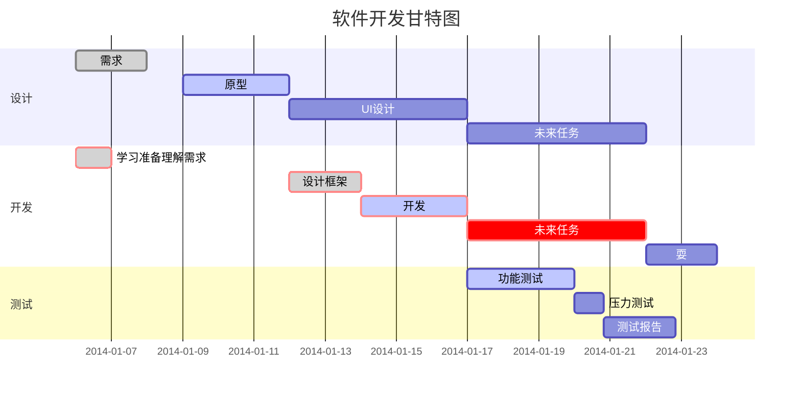

* 菜鸟官网教程：https://www.runoob.com/markdown/md-tutorial.html

# 标题

两种方法来编写标题

1. 使用 = 和 - 标记一级和二级标题（注意这是markdown的换行，并非真正换行）

```markdown
我展示的是一级标题
=================

我展示的是二级标题
-----------------
```

2. 使用 **#** 号可表示 1-6 级标题，一级标题对应一个 **#** 号，二级标题对应两个 **#** 号，一直到六级标题

```markdown
# 一级标题
## 二级标题
### 三级标题
#### 四级标题
##### 五级标题
###### 六级标题
```


# 文本格式

## 段落

Markdown 段落没有特殊的格式，直接编写文字就好，**段落的换行是使用两个以上空格加上回车**。


## 字体

```markdown
*斜体文本*
_斜体文本_
**粗体文本**
__粗体文本__
***粗斜体文本***
___粗斜体文本___
==高亮==
```

*斜体文本*
_斜体文本_
**粗体文本**
__粗体文本__
***粗斜体文本***
___粗斜体文本___
==高亮==


## 分割线

* 在一行中用三个以上的星号、减号、底线来建立一个分隔线，
* 行内不能有其他东西
* 可以在星号或是减号中间插入空格

```markdown
***

* * *

*****

- - -

----------
```

** *

---

____

## 删除线

* 文字的两端加上两个波浪线 **~~** 

```markdown
~~被删除了~~
```

~~被删除了~~


## 下划线

* 下划线可以通过 HTML 的 **<u>** 标签来实现：

```markdown
<u>下划线</u>
```

<u>下划线</u>


## 脚注

* 脚注是对文本的补充说明

```markdown
[^要注明的文本]
[^要注明的文本]: 鼠标移上去就会显示
```

我是一段文本[^hhhhh]

[^hhhhh]: 鼠标移上去就会显示


# 列表

* 列表分为有序列表和无序列表

1. 无序列表: 使用星号(*****)、加号(**+**)或是减号(**-**)作为列表标记，这些标记后面要添加一个空格，然后再填写内容：

```markdown
* 第一项
* 第二项
* 第三项

+ 第一项
+ 第二项
+ 第三项


- 第一项
- 第二项
- 第三项
```

2. 有序列表：使用数字并加上 **.** 号来表示：

```markdown
1. 第一项
2. 第二项
3. 第三项
```

3. 列表嵌套：只需在子列表中的选项前面添加四个空格即可：

```markdown
1. 第一项：
    - 第一项嵌套的第一个元素
    - 第一项嵌套的第二个元素
2. 第二项：
    - 第二项嵌套的第一个元素
    - 第二项嵌套的第二个元素
```


# 区块

* Markdown 区块引用是在段落开头使用 **>** 符号 ，然后后面紧跟一个**空格**符号：

```markdown
> shishi
> markdown
> hahaha
```

> shishi
> markdown
> hahaha


## 区块嵌套

```markdown
> 最外层
> > 第一层嵌套
> > > 第二层嵌套
```

> 最外层
>
> > 第一层嵌套
> >
> > > 第二层嵌套


## 区块中使用列表

```markdown
> 区块中使用列表
> 1. 第一项
> 2. 第二项
> + 第一项
> + 第二项
> + 第三项
```

> 区块中使用列表
> 1. 第一项
> 2. 第二项
> + 第一项
> + 第二项
> + 第三项


## 列表中使用区块

```markdown
* 第一项
    > 菜鸟教程
    > 学的不仅是技术更是梦想
* 第二项
```

* 第一项
    > 菜鸟教程
    > 学的不仅是技术更是梦想
* 第二项


# 代码

## 单行代码

```markdown
`alert()` 函数
```

`printf()` 函数

## 代码块

1. 代码区块使用 **4 个空格**或者一个**制表符（Tab 键）**

   function(a,b){

   ​	return a+b

   }

2. 用 **```** 包裹一段代码，并指定一种语言（也可以不指定）：

```markdown
​```javascript
(a,b) => {
	return a+b
}
​```
```

```javascript
(a,b) => {
	return a+b
}
```


# 链接

```markdown
[链接名称](链接地址)

或者

<链接地址>
```

[百度一下](baidu.com)

## 高级链接

* 我们可以通过变量来设置一个链接，变量赋值在文档末尾进行：

```markdown
这个链接用 1 作为网址变量 [百度][1]
然后在文档的结尾为变量赋值（网址）
[1]: http://www.baidu.com/
```

这个链接用 1 作为网址变量 [百度][1]
然后在文档的结尾为变量赋值（网址）

[1]: http://www.baidu.com/


# 图片

```markdown


```

* 当然，你也可以像网址那样对图片网址使用变量


# 表格

* Markdown 制作表格使用 **|** 来分隔不同的单元格，使用 **-** 来分隔表头和其他行。

```markdown
|  表头   | 表头  |
|  ----  | ----  |
| 单元格1  | 单元格 |
| 单元格2  | 单元格 |
```

| 表头    | 表头   |
| ------- | ------ |
| 单元格1 | 单元格 |
| 单元格2 | 单元格 |


## 对齐方式

```markdown
-: 设置内容和标题栏居右对齐。
:- 设置内容和标题栏居左对齐。
:-: 设置内容和标题栏居中对齐。
//
| 左对齐 | 右对齐 | 居中对齐 |
| :-----| ----: | :----: |
| 单元格 | 单元格 | 单元格 |
| 单元格 | 单元格 | 单元格 |
```

| 左对齐 | 右对齐 | 居中对齐 |
| :----- | -----: | :------: |
| 单元格 | 单元格 |  单元格  |
| 单元格 | 单元格 |  单元格  |


# 高级技巧

* 不在 Markdown 涵盖范围之内的标签，都可以直接在文档里面用 HTML 撰写。

* 目前支持的 HTML 元素有：`<kbd> <b> <i> <em> <sup> <sub> <br>`等 ，如：

```markdown
使用 <kbd>Ctrl</kbd>+<kbd>Alt</kbd>+<kbd>Del</kbd> 重启电脑
```

使用 <kbd>Ctrl</kbd>+<kbd>Alt</kbd>+<kbd>Del</kbd> 重启电脑


## 转义

* Markdown 使用了很多特殊符号来表示特定的意义，如果需要显示特定的符号则需要使用转义字符，Markdown 使用反斜杠转义特殊字符：

```markdown
**文本加粗** 
\*\* 正常显示星号 \*\*
```

**文本加粗** 
\*\* 正常显示星号 \*\*


* Markdown 支持以下这些符号前面加上反斜杠来帮助插入普通的符号：

```markdown
\   反斜线
`   反引号
*   星号
_   下划线
{}  花括号
[]  方括号
()  小括号
#   井字号
+   加号
-   减号
.   英文句点
!   感叹号
```

## 公式

* 菜鸟教程说明：https://www.runoob.com/markdown/md-advance.html

**Markdown Preview Enhanced** 使用 [KaTeX](https://github.com/Khan/KaTeX) 或者 [MathJax](https://github.com/mathjax/MathJax) 来渲染数学表达式。

KaTeX 拥有比 MathJax 更快的性能，但是它却少了很多 MathJax 拥有的特性。你可以查看 KaTeX supported functions/symbols 来了解 KaTeX 支持那些符号和函数。

默认下的分隔符：

- `$...$` 或者 `\(...\)` 中的数学表达式将会在行内显示。
- `$$...$$` 或者 `\[...\]` 或者 ````math` 中的数学表达式将会在块内显示。

```markdown
$$
\begin{Bmatrix}
   a & b \\
   c & d
\end{Bmatrix}
$$
$$
\begin{CD}
   A @>a>> B \\
@VbVV @AAcA \\
   C @= D
\end{CD}
$$
```

$$
f(x) = sin(x) + cos(x)
$$

$$
\begin{Bmatrix}
   a & b \\
   c & d
\end{Bmatrix}
$$
$$
\begin{CD}
   A @>a>> B \\
@VbVV @AAcA \\
   C @= D
\end{CD}
$$


## 流程图

* 出自菜鸟教程：https://www.runoob.com/markdown/md-advance.html

### 横向流程图

~~~markdown

~~~


### 竖向流程图

~~~markdown

~~~


### **标准流程图**

~~~markdown
```flow
st=>start: 开始框
op=>operation: 处理框
cond=>condition: 判断框(是或否?)
sub1=>subroutine: 子流程
io=>inputoutput: 输入输出框
e=>end: 结束框
st->op->cond
cond(yes)->io->e
cond(no)->sub1(right)->op
```
~~~

```flow
st=>start: 开始框
op=>operation: 处理框
cond=>condition: 判断框(是或否?)
sub1=>subroutine: 子流程
io=>inputoutput: 输入输出框
e=>end: 结束框
st->op->cond
cond(yes)->io->e
cond(no)->sub1(right)->op
```

### **标准流程图源码格式（横向**)

~~~markdown
```flow
st=>start: 开始框
op=>operation: 处理框
cond=>condition: 判断框(是或否?)
sub1=>subroutine: 子流程
io=>inputoutput: 输入输出框
e=>end: 结束框
st(right)->op(right)->cond
cond(yes)->io(bottom)->e
cond(no)->sub1(right)->op
```
~~~

```flow
st=>start: 开始框
op=>operation: 处理框
cond=>condition: 判断框(是或否?)
sub1=>subroutine: 子流程
io=>inputoutput: 输入输出框
e=>end: 结束框
st(right)->op(right)->cond
cond(yes)->io(bottom)->e
cond(no)->sub1(right)->op
```

### **UML时序图**

~~~markdown
```sequence
对象A->对象B: 对象B你好吗?（请求）
Note right of 对象B: 对象B的描述
Note left of 对象A: 对象A的描述(提示)
对象B-->对象A: 我很好(响应)
对象A->对象B: 你真的好吗？
```
//复杂
```sequence
Title: 标题：复杂使用
对象A->对象B: 对象B你好吗?（请求）
Note right of 对象B: 对象B的描述
Note left of 对象A: 对象A的描述(提示)
对象B-->对象A: 我很好(响应)
对象B->小三: 你好吗
小三-->>对象A: 对象B找我了
对象A->对象B: 你真的好吗？
Note over 小三,对象B: 我们是朋友
participant C
Note right of C: 没人陪我玩
```
~~~

```sequence
对象A->对象B: 对象B你好吗?（请求）
Note right of 对象B: 对象B的描述
Note left of 对象A: 对象A的描述(提示)
对象B-->对象A: 我很好(响应)
对象A->对象B: 你真的好吗？
```

```sequence
Title: 标题：复杂使用
对象A->对象B: 对象B你好吗?（请求）
Note right of 对象B: 对象B的描述
Note left of 对象A: 对象A的描述(提示)
对象B-->对象A: 我很好(响应)
对象B->小三: 你好吗
小三-->>对象A: 对象B找我了
对象A->对象B: 你真的好吗？
Note over 小三,对象B: 我们是朋友
participant C
Note right of C: 没人陪我玩
```

### **UML标准时序图**

~~~markdown

~~~


### **甘特图样例：**

~~~markdown

~~~

